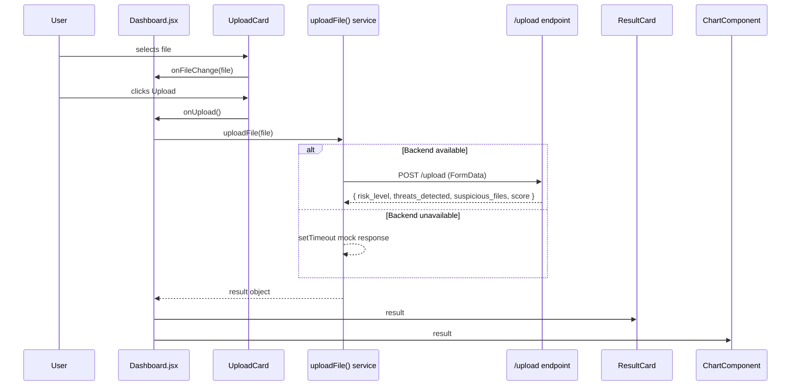
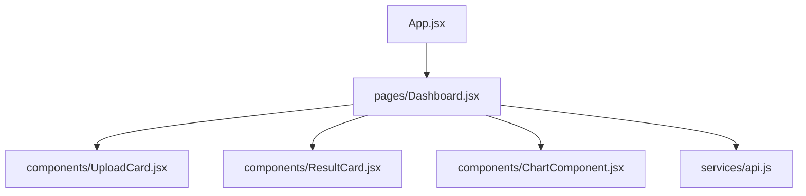

# Design Document: Cyber Triage Dashboard

## Overview

A modern React (Vite) single-page dashboard that allows analysts to upload files for cyber triage analysis, displays structured results (risk level, threat count, score, suspicious files), and visualizes threat data using Recharts. The UI uses Tailwind CSS with a dark theme and gracefully falls back to a mock API response when the backend is unavailable.

## Main Algorithm/Workflow



## Core Interfaces/Types

```javascript
// Result shape returned from API or mock
const AnalysisResult = {
  risk_level: "High" | "Medium" | "Low",  // string
  threats_detected: Number,                // integer >= 0
  suspicious_files: [String],              // array of filenames
  score: Number                            // 0–100
}

// Props: UploadCard
// onFileChange: (File) => void
// onUpload: () => void
// loading: boolean
// selectedFileName: string | null

// Props: ResultCard
// result: AnalysisResult

// Props: ChartComponent
// score: Number
// threatsDetected: Number
```

## Key Functions with Formal Specifications

### `uploadFile(file)`

```javascript
// src/services/api.js
async function uploadFile(file)
```

**Preconditions:**
- `file` is a valid `File` object (not null/undefined)
- `file.size > 0`

**Postconditions:**
- Returns a Promise that resolves to an `AnalysisResult` object
- If backend responds with 2xx: resolves with `response.data`
- If backend is unreachable (network error): resolves with mock `AnalysisResult` after ~1500ms delay
- Never rejects — errors are caught and mock data is returned as fallback

**Algorithm:**

```javascript
async function uploadFile(file) {
  const formData = new FormData()
  formData.append("file", file)

  try {
    const response = await API.post("/upload", formData, {
      headers: { "Content-Type": "multipart/form-data" }
    })
    return response.data
  } catch (error) {
    // Backend unavailable — return mock response
    return await mockUploadResponse()
  }
}

function mockUploadResponse() {
  return new Promise((resolve) => {
    setTimeout(() => {
      resolve({
        risk_level: "High",
        threats_detected: 3,
        suspicious_files: ["malware.exe", "trojan.dll"],
        score: 87
      })
    }, 1500)
  })
}
```

---

### `handleFileChange(event)` — Dashboard state handler

```javascript
function handleFileChange(event)
```

**Preconditions:**
- `event.target.files` is a `FileList` with at least one entry

**Postconditions:**
- `file` state is set to `event.target.files[0]`
- `result` state is reset to `null`
- `error` state is reset to `null`

---

### `handleUpload()` — Dashboard upload orchestrator

```javascript
async function handleUpload()
```

**Preconditions:**
- `file` state is not null

**Postconditions:**
- `loading` is `true` during the async call
- On success: `result` state is set to the `AnalysisResult`, `loading` is `false`
- On unexpected error: `error` state is set to a descriptive string, `loading` is `false`

**Algorithm:**

```javascript
async function handleUpload() {
  if (!file) return

  setLoading(true)
  setError(null)
  setResult(null)

  try {
    const data = await uploadFile(file)
    setResult(data)
  } catch (err) {
    setError("Upload failed. Please try again.")
  } finally {
    setLoading(false)
  }
}
```

---

### `getRiskColor(riskLevel)` — UI utility

```javascript
function getRiskColor(riskLevel)
```

**Preconditions:**
- `riskLevel` is a string

**Postconditions:**
- Returns a Tailwind CSS color class string
- `"High"` → `"text-red-400"`
- `"Medium"` → `"text-yellow-400"`
- `"Low"` → `"text-green-400"`
- Any other value → `"text-gray-400"`

```javascript
function getRiskColor(riskLevel) {
  const map = {
    High: "text-red-400",
    Medium: "text-yellow-400",
    Low: "text-green-400"
  }
  return map[riskLevel] ?? "text-gray-400"
}
```

---

## Component Structure



### `Dashboard.jsx` — State owner

```javascript
// State
const [file, setFile] = useState(null)
const [loading, setLoading] = useState(false)
const [result, setResult] = useState(null)
const [error, setError] = useState(null)

// Renders: page title, UploadCard, error banner, ResultCard + ChartComponent (when result exists)
```

### `UploadCard.jsx` — File input + upload button

```javascript
// Props: { onFileChange, onUpload, loading, selectedFileName }
// Renders: file input, selected filename display, upload button with spinner
```

### `ResultCard.jsx` — Structured results display

```javascript
// Props: { result }  (AnalysisResult)
// Renders: risk level badge, score, threat count, suspicious files list
```

### `ChartComponent.jsx` — Recharts visualization

```javascript
// Props: { score, threatsDetected }
// Renders: BarChart with two bars — Risk Score (0–100) and Threats Detected
```

---

## Example Usage

```javascript
// App.jsx
import Dashboard from "./pages/Dashboard"

function App() {
  return <Dashboard />
}

// Dashboard.jsx (abbreviated)
import { useState } from "react"
import { uploadFile } from "../services/api"
import UploadCard from "../components/UploadCard"
import ResultCard from "../components/ResultCard"
import ChartComponent from "../components/ChartComponent"

export default function Dashboard() {
  const [file, setFile] = useState(null)
  const [loading, setLoading] = useState(false)
  const [result, setResult] = useState(null)
  const [error, setError] = useState(null)

  const handleFileChange = (e) => {
    setFile(e.target.files[0])
    setResult(null)
    setError(null)
  }

  const handleUpload = async () => {
    if (!file) return
    setLoading(true)
    setError(null)
    try {
      const data = await uploadFile(file)
      setResult(data)
    } catch {
      setError("Upload failed. Please try again.")
    } finally {
      setLoading(false)
    }
  }

  return (
    <div className="min-h-screen bg-gray-950 text-white flex flex-col items-center py-12 px-4">
      <h1 className="text-3xl font-bold mb-8 text-cyan-400">Cyber Triage Tool</h1>
      <UploadCard
        onFileChange={handleFileChange}
        onUpload={handleUpload}
        loading={loading}
        selectedFileName={file?.name ?? null}
      />
      {error && <p className="mt-4 text-red-400">{error}</p>}
      {result && (
        <>
          <ResultCard result={result} />
          <ChartComponent score={result.score} threatsDetected={result.threats_detected} />
        </>
      )}
    </div>
  )
}
```

---

## Correctness Properties

- For all file inputs `f` where `f !== null`: `handleUpload()` must set `loading = true` before awaiting and `loading = false` after resolution
- For all `uploadFile(f)` calls: the function must never throw — it always resolves (real response or mock fallback)
- For all `result` values: `getRiskColor(result.risk_level)` must return a non-empty Tailwind class string
- For all `score` values `s` where `0 <= s <= 100`: `ChartComponent` must render a bar with height proportional to `s`
- When `file === null`: `handleUpload()` must return early without setting `loading = true`
- When backend returns a non-2xx response: `uploadFile` must resolve with mock data, not reject

---

## Tailwind & Dependency Setup

```javascript
// vite.config.js — add Tailwind plugin
import { defineConfig } from "vite"
import react from "@vitejs/plugin-react"
import tailwindcss from "@tailwindcss/vite"

export default defineConfig({
  plugins: [react(), tailwindcss()]
})
```

```javascript
// src/index.css — replace contents with:
@import "tailwindcss";
```

**Install commands:**
```bash
npm install recharts
npm install @tailwindcss/vite tailwindcss
```

---

## Dependencies

| Package | Version | Purpose |
|---|---|---|
| react | ^19 | UI framework |
| react-dom | ^19 | DOM rendering |
| axios | ^1.15 | HTTP client |
| recharts | ^2.x | Data visualization |
| tailwindcss | ^4.x | Utility-first CSS |
| @tailwindcss/vite | ^4.x | Vite Tailwind plugin |
| vite | ^8 | Build tool / dev server |
